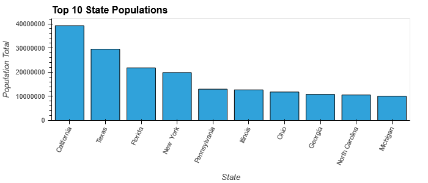
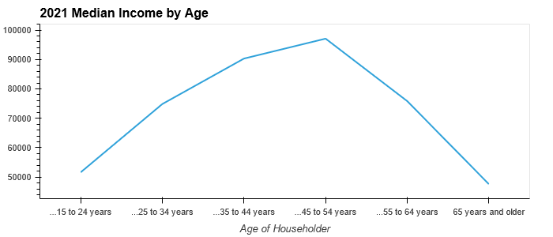

# "Your friendly Neighborhood Robo Advisor!"
## Project: Robo Advisor Market Research
## Code Name: Help Mom Retire!
--- 
### Project Summary
* Problem: We have noticed that while many more self investing options are available to consumers now than ever before, many users still do not enter the investment arena due to lack of knowledge, confidence or thinking they need large funds to get started. 

* Mission: Our goal was to identify the populations with the most need for getting into robo advisors, and which options are the best for them.

* Our Essential Questions
    * Which robo advisors are the best options to get into?

    * Where are the biggest concentrations of population to focus on?

    * Which demographics of the population are the best to market to?
---
### Project Details
#### Census Research
* We got the Census.gov API working and used it to pull population data and plot the states with the most population. 
        
* We found other data on the Census website and downloaded csvs. 
 * We found the income range by age in the United States and plotted it. This data shows that people in the age range of 45-59 are making the most in their lifetime, and it will likely drop after that. 
         
* We found data on roboadvisor users that shows only 32% of current users are female, which combined with our age range, makes the target new investors women ages 45-59, hence our project code name! 
* We also found educational attainment information by gender and filtered it for only women with at least a 7th grade education and above. We plotted the data as well. 
         

#### Roboadvisor Research
* Projections of Roboadvisors from Top Analyst Firms: 
    * Assets under management in the Robo-Advisors segment are projected to reach US$1.17tn in 2023.
    * Assets under management are expected to show an annual growth rate (CAGR 2023-2027) of 14.52% resulting in a projected total amount of US$2.02tn by 2027.
    * In the Robo-Advisors segment, the number of users is expected to amount to 49.04m users by 2027.
    * From a global comparison perspective it is shown that the highest assets under management is reached in the United States (US$1,172,000.00m in 2023). 
    * Source: [Statista](https://www.statista.com/forecasts/1259591/robo-advisors-managing-assets-united-states)

* Our data shows that roboadvisors are steadily growing. 
        
* Percent Share of users across different roboadvisor platforms in 2023 shows that the most widely used platforms are Betterment and Acorns. 
        
* Roboadvisor users are mostly younger people. 
        
* Roboadvisor users by gender shows that many more men are using these investing options than women. 
        

---
### Summary of Findings
* Education is good for the demographic that we have selected. 
* Female users(Moms) are limited in investing knowledge, access, and funds. They are a great group to market roboadvisors to.   
* After age 45, income options get limited and they should have all the opportunity to maximize their savings possible. 
* Simple investments like converting nickel and dime could be extremely useful and hence Acorns will be a good starting point since its tied to the lifestyle as well. 
* Betterment is good for beginners without having to know a whole lot of investment ideologies and how it works.

---
### If We had more time
* We were planning to use linear regression as our new python library in order to predict the user growth in RoboAdvisors over the next six years. We read into it on Stack Overflow but still weren't quite able to get it to work in time. 